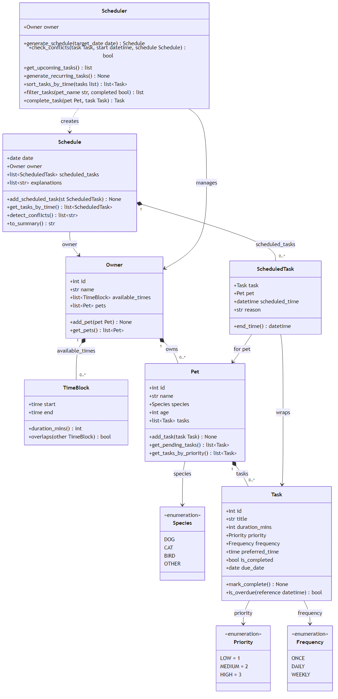

# PawPal+

A Streamlit app that helps a pet owner build a conflict-free daily care schedule, explain every decision, and track recurring tasks automatically.

---

## Features

### Priority-based scheduling
Tasks are scored before placement — `HIGH` priority tasks score 3, `MEDIUM` score 2, `LOW` score 1. Any task whose preferred time has already passed (overdue) gets a +2 bonus. The scheduler places the highest-scoring tasks first, so urgent care like medication or morning walks is never bumped by grooming.

### Time-slot fitting
The owner defines availability windows (e.g. 8–10 AM, 5–7 PM). The scheduler walks each window in 15-minute steps and places every task at the earliest open slot that fits its duration without overlapping anything already on the calendar. Tasks that don't fit in any window are skipped with a note rather than crashing.

### Sorting by preferred time
`Scheduler.sort_tasks_by_time()` uses Python's `sorted()` with a lambda key on `preferred_time`. Tasks with no preferred time sort last (keyed to `23:59`). The task list in the UI is always displayed in this chronological order.

### Filtering by pet or status
`Scheduler.filter_tasks(pet_name, completed)` lets you slice the task list by animal name, completion status, or both. The UI exposes this as a radio button — Pending / Completed / All — so an owner can instantly see what still needs doing today.

### Conflict detection with warnings
`Schedule.detect_conflicts()` scans every pair of scheduled tasks and checks whether their time windows overlap (`a.start < b.end and b.start < a.end`). Each overlap is returned as a human-readable warning string. In the UI these appear as `st.warning` callouts *above* the schedule table — visible before the owner scrolls — along with a tip on how to fix the conflict (shorten a duration or shift a preferred time).

### Automatic daily and weekly recurrence
`Scheduler.complete_task(pet, task)` marks a task done and immediately appends a fresh `Task` instance to the pet with a `due_date` set via `timedelta` — `+1 day` for `DAILY` tasks, `+7 days` for `WEEKLY`. `ONCE` tasks return `None` and no new instance is created. The UI confirms the next occurrence date in an `st.info` callout the moment the owner marks something complete.

### Scheduling explanations
Every task placed on the calendar gets a one-sentence reason: `"High priority — preferred 08:00 AM, scheduled 08:00 AM for Mochi."` These appear in the Why column of the schedule table so the owner understands the logic behind every placement.

---

## Project structure

```
pawpal_system.py   — all data classes and scheduling logic
app.py             — Streamlit UI
main.py            — terminal demo (sorting, filtering, recurrence, conflict detection)
tests/
  test_pawpal.py   — 16 automated tests
uml_final.png      — final class diagram
uml_final.mmd      — Mermaid source for the diagram
reflection.md      — design decisions and tradeoffs
```

---

## Getting started

### Setup

```bash
python -m venv .venv
source .venv/bin/activate   # Windows: .venv\Scripts\activate
pip install -r requirements.txt
```

### Run the app

```bash
streamlit run app.py
```

### Run the terminal demo

```bash
python main.py
```

---

## Testing PawPal+

```bash
python -m pytest
```

16 tests across 7 areas:

| Area | What it checks |
|---|---|
| Task completion | `mark_complete()` sets the flag; calling it twice is safe |
| Task addition | `add_task()` correctly grows the pet's task list |
| Edge cases | Pet with no tasks returns empty lists; scheduler produces an empty schedule |
| Sorting | Tasks added out of order come back chronological; no-time tasks sort last |
| Filtering | Isolates correctly by pet name and by completion status |
| Recurrence | DAILY → +1 day; WEEKLY → +7 days; ONCE → no new instance created |
| Conflict detection | Overlapping tasks produce a warning; sequential tasks and scheduler output are clean |

**Confidence level: ★★★★☆**
Core scheduling behaviors are verified end-to-end. The Streamlit UI layer and browser interactions are not covered by the automated suite.

---

## System design

The class diagram below shows how all components relate. See `uml_final.mmd` for the editable Mermaid source.



---

## Key classes

| Class | Responsibility |
|---|---|
| `Task` | A single care activity — duration, priority, frequency, preferred time, completion state |
| `Pet` | Groups tasks by animal; filters and sorts them |
| `Owner` | Holds pets and availability windows (`TimeBlock` list) |
| `TimeBlock` | A window of free time; can check overlap with another block |
| `Scheduler` | Scores, places, sorts, filters, and completes tasks |
| `Schedule` | The finished day plan; detects conflicts; produces a human-readable summary |
| `ScheduledTask` | A `Task` placed at a specific `datetime`, with a reason string |
